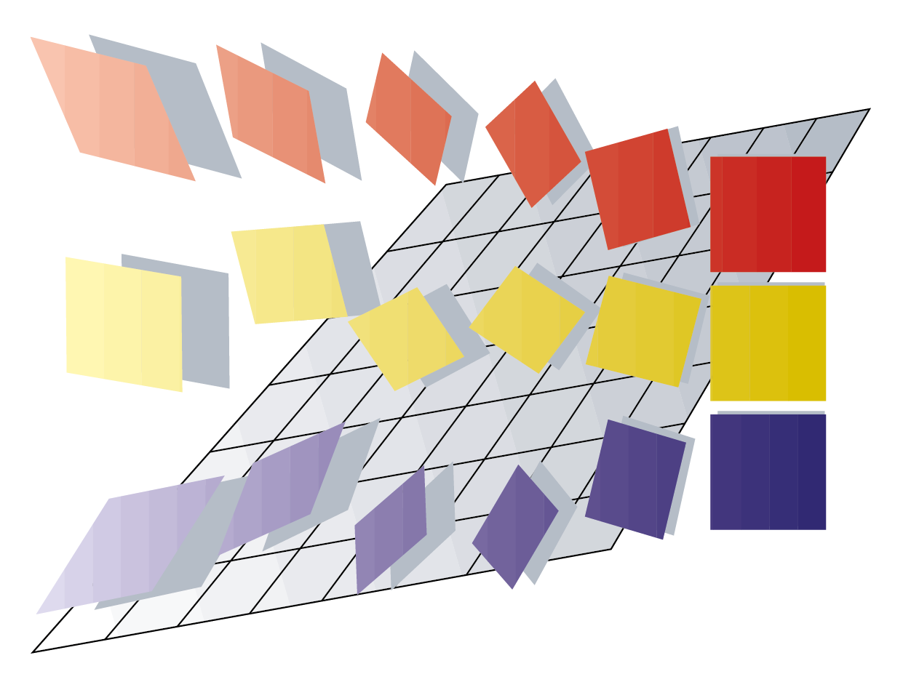

.. CALFEM for Python documentation master file, created by
   sphinx-quickstart on Mon May 30 23:34:38 2016.
   You can adapt this file completely to your liking, but it should at least
   contain the root `toctree` directive.

CALFEM for Python - Documentation
=================================

Welcome to the documentation for CALFEM for Python. On this page you will find examples of how to use CALFEM for Python as well as reference documentation for the different modules contained in the CALFEM for Python distribution. This is not a replacement for the CALFEM Manual, but contain information on how to use CALFEM in a Python context.

Contents:
---------

.. toctree::
   :maxdepth: 1
   :caption: Installation

   installation

.. toctree::
   :maxdepth: 2
   :caption: Tutorial

   calfem_examples
   exs1
   examples/exs2
   examples/exs3
   examples/exs4
   examples/exs7
   calfem_mesh_guide
   examples/exm13
   examples/exm2
   examples/exm3
   examples/exm6
   examples/exm10

.. toctree::
   :maxdepth: 1
   :caption: Developing

   developer
   
.. toctree::
   :maxdepth: 1
   :caption: Function Reference

   calfem_reference

==================
Indices and tables
==================

* :ref:`genindex`
* :ref:`modindex`
* :ref:`search`

